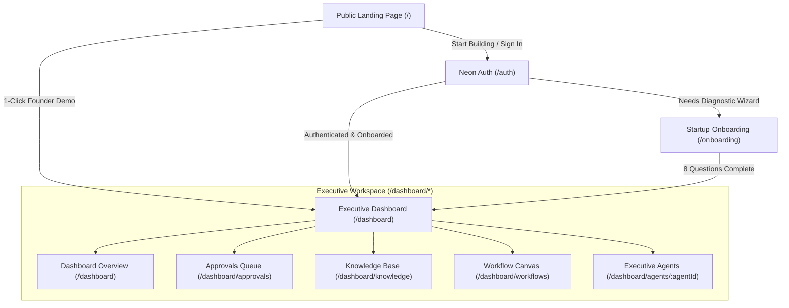

# CatalystOS: The Autonomous AI Operating System for Startup Founders

> **"One Founder. One Command. An AI Executive Council."**

---

## 1. Executive Summary: What is CatalystOS?

Building an early-stage startup is notoriously brutal. Over **90% of startups fail**, rarely due to poor engineering or bad ideas, but because **founders drown in operational context-switching**. 

A solo or early-stage founder is forced to wear eight hats at once:
- **CEO**: Setting strategic direction and prioritizing fires.
- **CFO**: Tracking runway, calculating burn rates, and financial scenario planning.
- **VP Talent / HR**: Writing job specifications, screening applicants, and benchmarking salaries.
- **General Counsel**: Reviewing NDAs, SaaS service agreements, and compliance obligations.
- **VP Growth**: Running campaigns, analyzing CAC/LTV, and identifying ICP market segments.
- **VP Operations**: Eliminating SaaS tool bloat and orchestrating sprint workflows.
- **Head of Investor Relations**: Drafting monthly shareholder updates and investor pitch prep.

**CatalystOS replaces this fragmentation with an autonomous AI Executive Council.** Powered by Google Gemini 2.5, Google Agent Development Kit (ADK) orchestration, and Deepgram voice intelligence, CatalystOS acts as a digital headquarters where the founder speaks or types a single corporate command, and a coordinated team of 8 specialized AI executives collaborates, analyzes, drafts corporate artifacts, and stages deliverables for one-click human approval.

---

## 2. Platform Architecture: Screen-by-Screen Breakdown

CatalystOS is structured into distinct, deterministic phase routes using `react-router-dom`:



### Screen 1: Public Showcase (`/`)
- **Purpose**: High-conversion landing experience demonstrating autonomous executive orchestration.
- **Key Features**:
  - **Dynamic Orbital Aesthetics**: Warm, low-contrast, glassmorphic UI built to modern enterprise standards.
  - **Live Agent Interactive Showcase**: Interactive typing simulation of the Chief of Staff, CFO, and Talent agents analyzing actual startup scenarios.
  - **1-Click Founder Sandbox**: Allows investors, judges, or prospective founders to bypass sign-up and immediately explore an initialized corporate workspace with full council telemetry.

### Screen 2: Authentication & Multi-Tenant Isolation (`/auth`)
- **Purpose**: Enterprise security and workspace bootstrapping.
- **Key Features**:
  - **Neon PostgreSQL Native Auth**: Secure bcrypt password hashing and signed JSON Web Tokens (JWT).
  - **Automatic Workspace Provisioning**: Every new account is instantly assigned a canonical startup workspace in PostgreSQL with 8 initialized AI agents and foundational vector storage.
  - **Zero-Flicker Session Check**: Fast memory-cached validation that routes directly to `/dashboard`.

### Screen 3: Conversational Setup Wizard (`/onboarding`)
- **Purpose**: Tailors the AI executive council to the founder's specific industry, stage, and operational goals.
- **Key Features**:
  - Dual setup paths: **"Existing Startup"** (imports ARR, team size, primary product) vs. **"New Startup Idea"** (pre-seed validation, customer problem, runway budget).
  - 8-question conversational progression that populates baseline parameters for financial runway calculations, target ICP profiles, and agent prompt context.

### Screen 4: Executive Control Room (`/dashboard`)
- **Purpose**: The founder's daily command center for company health, telemetry, and live agent interaction.
- **Key Features**:
  - **Financial Telemetry & Treasury**: Live tracking of Cash Reserves, Monthly Burn Rate, Runway (months), and composite Company Health Score (0-100%).
  - **Dual-Core AI Chief of Staff (Atlas / Sophia Vance)**: A floating voice and chat companion that accepts high-level business goals, breaks them into departmental sprints, and delegates tasks to specialist agents.
  - **Deepgram Voice Engine**: Low-latency, full-duplex speech-to-text and text-to-speech for hands-free founder operation while driving or traveling.
  - **Command Palette (`⌘K`)**: Instant keyboard navigation across all workspaces and agent tools.

### Screen 5: Human-in-the-Loop Approvals Queue (`/dashboard/approvals` or `/approvals`)
- **Purpose**: Strict corporate governance and safety.
- **Key Features**:
  - Autonomous AI agents **cannot** spend money, send contracts, or execute critical hires without explicit founder sign-off.
  - Generates concrete deliverables: Employment Offers, Vendor Agreements, Pricing Overhauls, and Board Updates.
  - 1-click **Approve**, **Reject**, or **Request Revision with Feedback**.

### Screen 6: Corporate Knowledge Base & Vector RAG (`/dashboard/knowledge` or `/knowledge`)
- **Purpose**: Grounding AI decisions in actual company facts, avoiding hallucinations.
- **Key Features**:
  - Drag-and-drop ingestion of PDF, DOCX, TXT, and Markdown files (Pitch Decks, Cap Tables, Customer Interview Transcripts, Legal NDAs).
  - Ingestion pipeline chunks documents and indexes them in **PostgreSQL `pgvector`** for sub-100ms semantic similarity search.

### Screen 7: Autonomous Workflow Canvas (`/dashboard/workflows` or `/workflows`)
- **Purpose**: Visual simulation of cross-departmental initiatives.
- **Key Features**:
  - Interactive Directed Acyclic Graph (DAG) displaying agent handoffs.
  - Monte Carlo simulation of sprint timelines, budget requirements, and potential legal/financial bottlenecks before spending a dollar.

### Screen 8: Executive Agent Workspace (`/dashboard/agents/:agentId` or `/agents`)
- **Purpose**: Direct 1-on-1 strategic deep-dives with specific C-suite specialists.
- **Key Features**:
  - **Sophia Vance (Atlas)**: CEO — Autonomous roadmap synthesis and multi-agent coordination.
  - **Aura Vance**: CFO — Cash burn models, runway forecasts, and hiring budget checks.
  - **Echo Vance**: VP Talent — Job postings, candidate rubrics, and organizational design.
  - **Vector Vance**: VP Growth — Go-to-market strategies, CAC/LTV analysis, and distribution funnels.
  - **Nexus Vance**: General Counsel — Intellectual property protection, contract drafting, and regulatory compliance.
  - **Helix Vance**: VP Operations — SaaS stack optimization and operational efficiency.
  - **Apex Vance**: Head of IR — Pitch decks, investor updates, and cap table models.
  - **Sentry Vance**: Compliance & Risk Auditor — Risk scoring and sanity checks before deliverables reach the approval queue.

---

## 3. Real-Life Case Study: How a Founder Uses CatalystOS

To illustrate the concrete value of CatalystOS, consider this real-world scenario of an early-stage startup.

```mermaid
sequenceDiagram
    autonumber
    actor Founder as Solo Founder (David)
    participant CoS as Atlas (CEO / Chief of Staff)
    participant CFO as Aura (CFO Agent)
    participant Talent as Echo (Talent Agent)
    participant Legal as Nexus (Legal Agent)
    participant Auditor as Sentry (Risk Auditor)
    participant Queue as Approvals Queue (/approvals)

    Founder->>CoS: "We have an offer for a $60K enterprise pilot, but they require SOC2 compliance and a custom SLA within 45 days. Can we afford to hire a Security Engineer and commit without dropping runway below 12 months?"
    
    rect rgb(240, 240, 245)
        note over CoS, Auditor: Parallel Autonomous Multi-Agent Delegation
        CoS->>CFO: Model $130K Security Hire + SOC2 audit cost against current $245K treasury
        CoS->>Talent: Benchmark salary, draft Job Requisition and 45-day hiring plan
        CoS->>Legal: Draft Enterprise SLA Addendum with SOC2 milestones & liability caps
        CFO-->>CoS: Burn increases from $15K to $26K/mo; with $60K pilot, runway stays at 13.8 months (SAFE)
        Talent-->>CoS: Job spec complete; recommend contractor-to-hire to meet 45-day SLA
        Legal-->>CoS: SLA addendum drafted; capped damages at 1x contract value
    end

    CoS->>Auditor: Audit joint package for operational feasibility & cash risk
    Auditor-->>CoS: Risk Score: LOW (8/100). Contingent on closing pilot upfront payment.
    
    CoS->>Founder: Unified Executive Report + Action Plan
    Founder->>Queue: Reviews drafted SLA Contract & Security Hire Requisition
    Founder->>Queue: 1-Click "Approve Deliverables"
```

### The Company Context
- **Startup Name**: *DataPulse AI* (Enterprise Data Observability).
- **Founder**: David (Solo Technical Founder).
- **Financial Status**:
  - Cash Balance: **$245,000**
  - Monthly Burn Rate: **$15,000**
  - Current Runway: **16.3 Months**
- **The Unexpected Crisis / Opportunity**:
  An enterprise prospect (a regional fintech) offers to sign a **$60,000 ARR pilot contract**, but demands:
  1. Guaranteed **99.9% uptime SLA** with liquidated damages.
  2. Mandatory **SOC2 Type II compliance** within 6 months.
  3. A dedicated **Senior Security Engineer** on the vendor team.

### Step 1: The Prompt (Voice / Text Command)
Instead of hiring an expensive law firm ($800/hr) and spending 3 weeks in spreadsheets, David opens CatalystOS on his laptop or phone:

> *"Atlas, we just received a $60K enterprise pilot offer from a fintech. They require a custom 99.9% uptime SLA and SOC2 compliance. Can we afford to hire a Senior Security Engineer at market rates without dropping our runway below 12 months? If so, draft the SLA and the job spec."*

### Step 2: Autonomous Multi-Agent Delegation
The **Chief of Staff (Atlas)** parses David's intent and dispatches tasks to three specialist agents simultaneously:

1. **Aura Vance (CFO)**:
   - Queries `pgvector` knowledge base for current cash reserves ($245K) and burn ($15K/mo).
   - Simulates a $130K/year security hire ($10.8K/mo) plus $18K SOC2 audit tooling.
   - Calculates the net impact: Adding the $60K pilot revenue upfront preserves runway at **13.8 months** (above the 12-month threshold).
   - **Verdict**: **Financially Approved**.

2. **Echo Vance (VP Talent)**:
   - Analyzes tech-stack requirements from DataPulse's uploaded architecture docs.
   - Drafts a complete **Senior Security & Compliance Engineer Job Description** including AWS IAM, Kubernetes security, and SOC2 audit experience.
   - Suggests a contractor-to-hire model to meet the 45-day deadline.

3. **Nexus Vance (General Counsel)**:
   - Scans standard SaaS industry standards.
   - Drafts a customized **Enterprise SLA Addendum** with 99.9% uptime, scheduled maintenance carve-outs, and damages strictly capped at 1 month of subscription fees (protecting DataPulse from uncapped liability).

4. **Sentry Vance (Auditor)**:
   - Reviews the joint output of Finance, Talent, and Legal.
   - Verifies that the SLA does not contradict DataPulse's cloud hosting capabilities.

### Step 3: The Unified Executive Synthesis
Within seconds, Atlas presents David with a concise executive brief:

```markdown
### Executive Council Recommendation: PROCEED WITH ENTERPRISE PILOT
- **Runway Impact**: With $60,000 contract revenue collected annually, runway settles at 13.8 months (Goal: >12 mo satisfied).
- **Hiring Strategy**: Requisition drafted for Contract-to-Hire Security Engineer ($75/hr or $130K FTE).
- **Legal Safeguard**: SLA addendum generated with 1x monthly fee liability cap.
- **Deliverables Ready**: 2 items staged in Approvals Queue for your signature.
```

### Step 4: Founder Review & Sign-Off (`/dashboard/approvals`)
David navigates to `/dashboard/approvals`:
- Inspects the **Enterprise SLA Agreement**: Reads the liability clause drafted by Nexus. Clicks **"Approve"**.
- Inspects the **Security Engineer Requisition**: Clicks **"Approve & Post to Boards"**.

### Step 5: Real-Time Synchronization & Execution
- The **Corporate Knowledge Base** (`/dashboard/knowledge`) is automatically indexed with the newly approved SLA terms.
- The **Workflow Canvas** (`/dashboard/workflows`) creates a 45-day milestone sprint tracking SOC2 readiness.
- Treasury telemetry on `/dashboard` updates to reflect projected pilot revenue.

**Result**: A workflow that normally consumes **3 weeks and $15,000 in advisor fees** was finalized in **4 minutes with zero overhead**.

---

## 4. Business Value Matrix: Traditional Founder vs. CatalystOS

| Activity | Traditional Founder | Founder with CatalystOS |
| :--- | :--- | :--- |
| **Financial Modeling** | 6 hours in Excel, prone to broken formulas and outdated burn figures. | **Instant scenario simulation** run directly against live Neon DB balance. |
| **Legal Agreements** | $500–$1,000/hr outside counsel with 5-day turnaround times. | **General Counsel Agent (Nexus)** generates startup-tested NDAs and SLAs in seconds. |
| **Job Descriptions & Screening** | 10 hours scouring job boards and rewriting generic specs. | **Talent Agent (Echo)** auto-drafts tailored rubrics based on the company's tech stack. |
| **Operational SaaS Audit** | Paying for 15 forgotten subscriptions ($2,000/mo wasted). | **Operations Agent (Helix)** audits recurring spend and flags unused seats. |
| **Investor Reporting** | Frantic weekend assembling metrics before monthly board email. | **IR Agent (Apex)** compiles monthly progress memos directly from sprint deliverables. |
| **Safety & Control** | Risky autonomous bots that post or send without human oversight. | **Deterministic Human-in-the-Loop Queue** (`/approvals`) guarantees founder veto power. |

---

## 5. Technology Stack Summary

- **Frontend**: React 19, TypeScript, Tailwind CSS, Lucide Icons, Framer Motion, GSAP, DotLottie.
- **Routing**: `react-router-dom` v7 with dedicated phase isolation (`/`, `/auth`, `/onboarding`, `/dashboard`, `/approvals`, `/knowledge`, `/workflows`, `/agents`).
- **Backend API**: Express / Node Gateway (port 3000) + FastAPI Python Microservice (port 8000).
- **Database & RAG**: PostgreSQL 16 + `pgvector` hosted on **Neon Serverless**.
- **AI Core**: Google Gemini 2.5 Flash / Pro via Google GenAI SDK & Google ADK.
- **Voice Intelligence**: Deepgram Nova-2 WebSockets for real-time speech-to-text and streaming speech synthesis.
- **Containerization**: Docker Compose with multi-stage builds.
