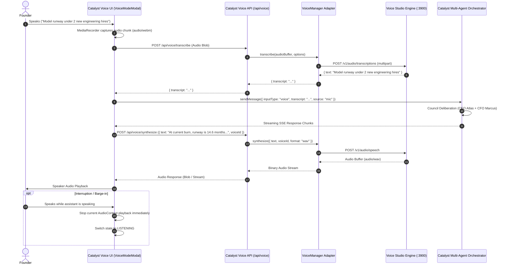

# Catalyst OS — Voice Architecture & Data Flow

## 1. Sequence Diagram: Full Voice Interaction Cycle



---

## 2. Abstraction Interface Specification

```typescript
export interface VoiceProvider {
  id: string;
  name: string;
  
  transcribe(options: VoiceTranscriptionOptions): Promise<VoiceTranscriptionResult>;
  synthesize(options: VoiceSynthesisOptions): Promise<VoiceSynthesisResult>;
  listVoices(): Promise<VoiceProfile[]>;
  createVoiceProfile(profile: Partial<VoiceProfile>, sampleAudio?: Buffer): Promise<VoiceProfile>;
  deleteVoiceProfile(id: string): Promise<boolean>;
  getCapabilities(): Promise<VoiceCapabilities>;
  checkHealth(): Promise<boolean>;
}
```

---

## 3. Privacy & Processing Domains

Catalyst explicitly categorizes each voice transaction into one of three execution tiers:

1. **`LOCAL`**: Audio processed strictly on-device via local Voice Studio daemon or browser Web Speech. Audio never leaves the local network.
2. **`REMOTE`**: Explicitly opted-in cloud speech endpoints (e.g. cloud Whisper or external TTS API).
3. **`PROCESSING`**: Real-time transient memory state during active inference. Raw microphone buffers are purged immediately after transcription.
